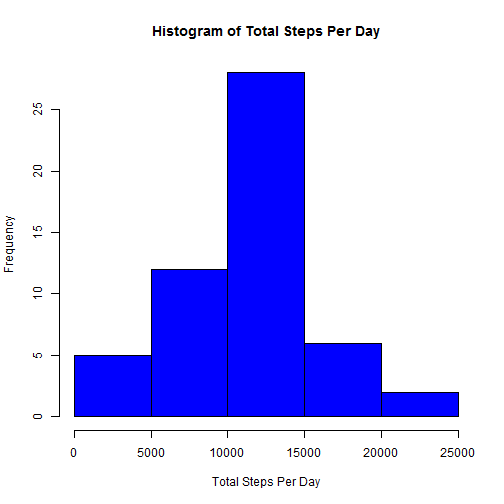
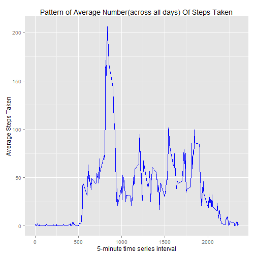
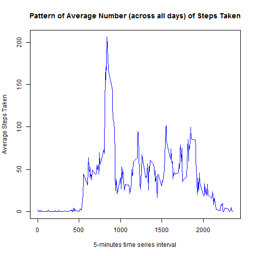
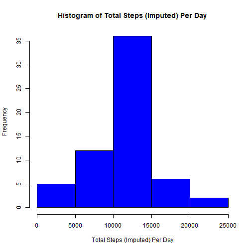
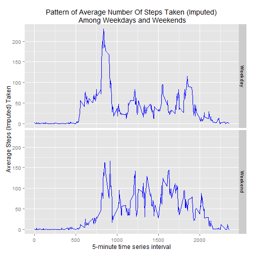

This is an R Markdown document. Markdown is a simple formatting syntax for authoring HTML, PDF, and MS Word documents. For more details on using R Markdown see <http://rmarkdown.rstudio.com>.

## Introduction
This assignment makes use of data from a personal activity monitoring device. THis device collects data at 5 minutes intervals throughout the dat. THe data consists of two months of data from an anonymous individual collected during the month of October and November, 2012 and include the number of steps taken in 5 minutes interval each day.


## Data
Dataset is stored in a comma-separated-value(CSV) file and can be downloaded from [here](https://d396qusza40orc.cloudfront.net/repdata%2Fdata%2Factivity.zip).  

The variables included in the dataset are:  
* steps: The number of steps taken in a 5-minute interval. Missing values are coded as NA
* date: format in 'yyyy/mm/dd'. The date on which the measurement was taken
* interval: Identifier for the 5-minute interval in which measurement was taken


## Loading the libraries

```r
library(ggplot2)
```


## Loading and preprocessing the data

```r
activity <- read.csv("activity.csv", header=TRUE, colClasses=c("integer","Date","integer"))
```


## Summary of Data

```r
head(activity)
```

```
##   steps       date interval
## 1    NA 2012-10-01        0
## 2    NA 2012-10-01        5
## 3    NA 2012-10-01       10
## 4    NA 2012-10-01       15
## 5    NA 2012-10-01       20
## 6    NA 2012-10-01       25
```

```r
str(activity)
```

```
## 'data.frame':	17568 obs. of  3 variables:
##  $ steps   : int  NA NA NA NA NA NA NA NA NA NA ...
##  $ date    : Date, format: "2012-10-01" "2012-10-01" ...
##  $ interval: int  0 5 10 15 20 25 30 35 40 45 ...
```

```r
names(activity)
```

```
## [1] "steps"    "date"     "interval"
```

```r
sum(is.na(activity$steps))
```

```
## [1] 2304
```

```r
sum(is.na(activity$date))
```

```
## [1] 0
```

```r
sum(is.na(activity$interval))
```

```
## [1] 0
```


## Cleaning the data to remove missing data  
We can observe that the data frame, activityData, includes some missing values in the 
"steps" column.  

```r
activityData <- activity[complete.cases(activity),]
```


## What is mean total number of steps taken per day?

```r
## aggregate data by date with sum() function to get total steps per day
stepsTotalByDate <- aggregate(steps~date, data=activityData, sum)
str(stepsTotalByDate)
```

```
## 'data.frame':	53 obs. of  2 variables:
##  $ date : Date, format: "2012-10-02" "2012-10-03" ...
##  $ steps: int  126 11352 12116 13294 15420 11015 12811 9900 10304 17382 ...
```

### Histogram of The Total Number of Steps Taken Each Day:

```r
## a histogram of steps with 
##    x as the quantative total steps per day and 
##    y as the frequency/number of days of the groups by defined on x, which is the
##    number of days having the total steps of x.
hist(stepsTotalByDate$steps, col="blue", xlab="Total Steps Per Day", main="Histogram of Total Steps Per Day")
```

 

### Mean and Meduan of the total number of steps taken per day are:

```r
stepsMeanByDate <- format(as.integer(mean(stepsTotalByDate$steps)), scientific=FALSE)
stepsMedianByDate <- format(as.integer(median(stepsTotalByDate$steps)), scientific=FALSE)
```
#### Mean of total steps is 10766; And median of total steps is 10765.  

To verify the result above, use summary() function: 

```r
summary(stepsTotalByDate)
```

```
##       date                steps      
##  Min.   :2012-10-02   Min.   :   41  
##  1st Qu.:2012-10-16   1st Qu.: 8841  
##  Median :2012-10-29   Median :10765  
##  Mean   :2012-10-30   Mean   :10766  
##  3rd Qu.:2012-11-16   3rd Qu.:13294  
##  Max.   :2012-11-29   Max.   :21194
```


## What is the average daily activity pattern?

```r
stepsAvgByInterval <- aggregate(steps~interval, data=activityData, mean)
str(stepsAvgByInterval)
```

```
## 'data.frame':	288 obs. of  2 variables:
##  $ interval: int  0 5 10 15 20 25 30 35 40 45 ...
##  $ steps   : num  1.717 0.3396 0.1321 0.1509 0.0755 ...
```

### Make a time series plot (i.e. type = "l") of the 5-minute interval (x-axis) and the average number of steps taken, averaged across all days (y-axis)
#### ggplot2 chart -

```r
ggplot(stepsAvgByInterval, aes(interval, y=steps)) +
          geom_line(stat="identity", col="blue") +
          labs(x="5-minute time series interval", y="Average Steps Taken", title="Pattern of Average Number(across all days) Of Steps Taken")
```

 

Or use basic plot function to plot the chart -

```r
plot(stepsAvgByInterval$interval, stepsAvgByInterval$steps, type="l", col="blue",xlab="5-minutes time series interval", ylab="Average Steps Taken", main="Pattern of Average Number (across all days) of Steps Taken")
```

 

### Which 5-minute interval, on average across all the days in the dataset, contains the maximum number of steps?

```r
## Find the row index with max average steps among all intervals
## Then locate the entire row with row index
maxStepsAtInr <- stepsAvgByInterval[which.max(stepsAvgByInterval$steps), ]
maxStepsAtInr
```

```
##     interval    steps
## 104      835 206.1698
```
#### The maximum number of steps is 206 at interval: 835.


## Imputing missing values
### Calculate and report the total number of missing values in the dataset (i.e. the total number of rows with NAs)

```r
## After examing the data frame, activity, only steps column has NA value. 
## Use is.na() to check whether the value is NA or not and sum() to get total.
rowTotalNA <- sum(is.na(activity$steps))
```
#### The total number of rows with NAs is 2304.

Replace NA in activity data frame with average/mean of the 5-minute interval

```r
## Merge original data with 5-min interval average data
mergedActy <- merge(activity, stepsAvgByInterval, by="interval", all=TRUE)

## Replace rows with NA steps with mean value of 5-min interval steps
mergedActy[is.na(mergedActy$steps.x),]$steps.x <- mergedActy[is.na(mergedActy$steps.x),]$steps.y
```

Create a new dataset that is equal to the original dataset but with the missing data filled in.

```r
## Select only the first 3 columns for the new dataset filled with mean of 5-min steps
activityFilledData <- mergedActy[ ,c("steps.x", "date", "interval")]
## Modify the column name with colnames() function
colnames(activityFilledData) <- c("steps", "date", "interval")

## Peek of final dataset
head(activityFilledData)
```

```
##      steps       date interval
## 1 1.716981 2012-10-01        0
## 2 0.000000 2012-11-23        0
## 3 0.000000 2012-10-28        0
## 4 0.000000 2012-11-06        0
## 5 0.000000 2012-11-24        0
## 6 0.000000 2012-11-15        0
```

```r
str(activityFilledData)
```

```
## 'data.frame':	17568 obs. of  3 variables:
##  $ steps   : num  1.72 0 0 0 0 ...
##  $ date    : Date, format: "2012-10-01" "2012-11-23" ...
##  $ interval: int  0 0 0 0 0 0 0 0 0 0 ...
```
#### The new dataset filled with mean of 5-min interval steps is activityFilledData.

### Histogram of The Total Number of Steps (Imputed) Taken Each Day:

```r
stepsTotalImputedByDate <- aggregate(steps~date, data=activityFilledData, sum)
str(stepsTotalImputedByDate)
```

```
## 'data.frame':	61 obs. of  2 variables:
##  $ date : Date, format: "2012-10-01" "2012-10-02" ...
##  $ steps: num  10766 126 11352 12116 13294 ...
```

```r
## a histogram of steps with 
##    x as the quantative total steps per day and 
##    y as the frequency/number of days of the groups by defined on x, which is the
##    number of days having the total steps of x.
hist(stepsTotalImputedByDate$steps, col="blue", xlab="Total Steps (Imputed) Per Day", main="Histogram of Total Steps (Imputed) Per Day")
```

 

###  Mean and Meduan of the total number of steps (imputed) taken per day are:

```r
stepsImputedMeanByDate <- format(as.integer(mean(stepsTotalImputedByDate$steps)), scientific=FALSE)
stepsMedianImputedByDate <- format(as.integer(median(stepsTotalImputedByDate$steps)), scientific=FALSE)
```
#### Mean of total imputed steps is 10766; And median of total imputed steps is 10766.  

To verify the result above, use summary() function: 

```r
summary(stepsTotalImputedByDate)
```

```
##       date                steps      
##  Min.   :2012-10-01   Min.   :   41  
##  1st Qu.:2012-10-16   1st Qu.: 9819  
##  Median :2012-10-31   Median :10766  
##  Mean   :2012-10-31   Mean   :10766  
##  3rd Qu.:2012-11-15   3rd Qu.:12811  
##  Max.   :2012-11-30   Max.   :21194
```

### Do these values differ from the estimates from the first part of the assignment? 
#### Conclusion: Not much difference. Only the median value has minor increase from 10765 to 10766 after taking 5-min mean value to represent missing data.


## Are there differences in activity patterns between weekdays and weekends?

### Create a new factor variable in the dataset with two levels - "weekday" and "weekend" indicating whether a given date is a weekday or weekend day
To compare weekdays and weekends activity patterns, we first add a new column, day, to show the date of a row is a weekday or a weekend.

```r
activityFilledData$day<- ifelse(weekdays(activityFilledData$date) %in% c("Saturday","Sunday"), "Weekend", "Weekday")

head(activityFilledData)
```

```
##      steps       date interval     day
## 1 1.716981 2012-10-01        0 Weekday
## 2 0.000000 2012-11-23        0 Weekday
## 3 0.000000 2012-10-28        0 Weekend
## 4 0.000000 2012-11-06        0 Weekday
## 5 0.000000 2012-11-24        0 Weekend
## 6 0.000000 2012-11-15        0 Weekday
```

Aggregate average steps taken by 5-min interval and weekday/weekend

```r
stepsImputedMeanByInrByWkD <- aggregate(steps ~ interval+day, data=activityFilledData, mean)
```

### Make a panel plot containing a time series plot (i.e. type = "l") of the 5-minute interval (x-axis) and the average number of steps taken, averaged across all weekday days or weekend days (y-axis)

```r
## plot the data with line chart and annotate the plot
## Lattice plot example:
## xyplot(steps ~ interval | day, stepsImputedMeanByInrByWkD, type="l", layout=c(1,2), ## xlab="5-minute time series interval", ylab="Average Steps (Imputed) Taken", 
## main="Pattern of Average Number Of Steps Taken (Imputed)\n Among Weekdays and Weekends")

ggplot(stepsImputedMeanByInrByWkD, aes(x=interval, y=steps)) +
     geom_line(col="blue") +
     facet_grid(day~.) +
     labs(x="5-minute time series interval", y="Average Steps (Imputed) Taken", title="Pattern of Average Number Of Steps Taken (Imputed)\n Among Weekdays and Weekends")
```

 

#### Conclusions: Based on the plotted chart, during weekends, more steps are taken across all day than weekdays. And during weekdays, more steps are taken at 800-900 intervals than the rest of the day.

Course: Coursera, Reproducible Research  
Assignment: Peer Assessment 1  
Year: 2015  


